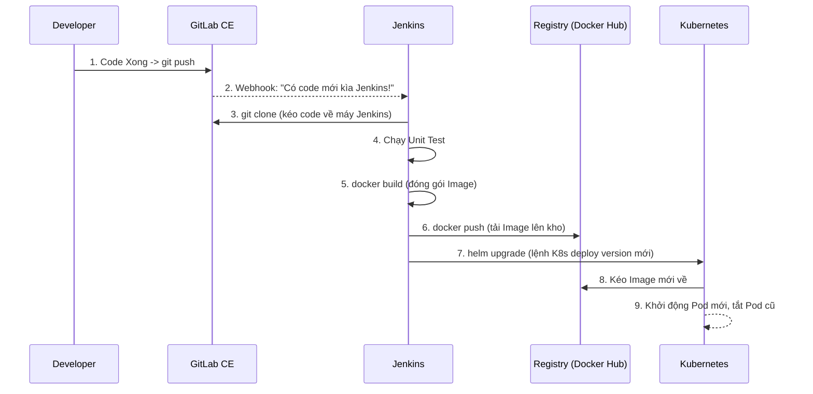

# Bài 13: Tổng quan CI/CD và Kiến trúc hệ thống

Chào mừng bạn đến với **Phần 5: CI/CD Pipeline**. Bạn đã biết cách đóng gói và chạy ứng dụng trên Kubernetes (K8s). Nhưng ở môi trường thực tế, các Lập trình viên (Developers) viết code mỗi ngày. Chẳng lẽ mỗi lần có code mới, bạn lại phải tự tay `docker build`, đẩy lên mạng, rồi sửa file YAML để K8s cập nhật?

**Tất nhiên là không!** Đó là lúc chúng ta cần đến **CI/CD (Continuous Integration / Continuous Deployment)** để tự động hóa 100% quá trình từ lúc Developer gõ code xong cho đến khi ứng dụng chạy trơn tru trên K8s.

---

## 1. Khái niệm CI/CD

*   **CI (Continuous Integration - Tích hợp liên tục):** Là quá trình tự động nhận code mới từ Developer, sau đó tự động **Build** (biên dịch), tự động **Test** (kiểm thử), và đóng gói thành một bản phát hành (Docker Image). Mục tiêu: Phát hiện lỗi ngay lập tức.
*   **CD (Continuous Deployment - Triển khai liên tục):** Lấy cái bản phát hành (Docker Image) vừa tạo ở bước CI, tự động cài đặt (Deploy) nó lên các môi trường (Dev, Staging, Production). Mục tiêu: Đưa tính năng mới đến tay người dùng nhanh nhất có thể.

---

## 2. Kiến trúc hệ thống CI/CD (GitLab CE -> Jenkins -> K8s)

Trong khóa học này, chúng ta sẽ xây dựng một quy trình chuẩn doanh nghiệp với 3 "nhân vật chính":

1.  **GitLab CE (Community Edition):** 
    *   **Vai trò:** Nơi chứa Source Code (Kho lưu trữ Git).
    *   **Nhiệm vụ:** Khi Developer thực hiện `git push` hoặc tạo Merge Request, GitLab sẽ bắn ra một thông báo (gọi là Webhook) để "đánh thức" Jenkins.
2.  **Jenkins:**
    *   **Vai trò:** Trái tim của toàn bộ quy trình tự động hóa (Automation Server).
    *   **Nhiệm vụ:** Nhận lệnh từ GitLab, Jenkins sẽ chạy một kịch bản gọi là `Jenkinsfile` để: Kéo code về -> Chạy Test -> Build Docker Image -> Push Image lên mạng -> Ra lệnh cho K8s deploy.
3.  **Kubernetes (K8s):**
    *   **Vai trò:** Nơi chạy ứng dụng cuối cùng.
    *   **Nhiệm vụ:** Nhận lệnh từ Jenkins (ví dụ qua `kubectl` hoặc `helm`), K8s sẽ kéo Docker Image mới nhất về và thực hiện Rolling Update (cập nhật không gián đoạn).
4.  **Container Registry (Kho chứa Docker Image):**
    *   **Vai trò:** Nơi lưu trữ các file Docker Image sau khi Jenkins build xong (có thể là Docker Hub, Harbor, hoặc chính GitLab Container Registry).

### Sơ đồ luồng hoạt động (Workflow):

---

## 3. Tại sao chọn Jenkins và GitLab CE?

Trên thị trường có rất nhiều công cụ (như GitLab CI, GitHub Actions, CircleCI). Nhưng **Jenkins** vẫn là "vị vua" trong thế giới CI/CD vì:
*   **Miễn phí 100%** và mã nguồn mở.
*   **Hệ sinh thái Plugin khổng lồ:** Bạn có thể tích hợp Jenkins với hầu như MỌI thứ trên đời (Slack, JIRA, SonarQube, AWS, K8s).
*   Tính tùy biến cực cao thông qua `Jenkinsfile` (viết bằng ngôn ngữ Groovy).

Kết hợp với **GitLab CE** (cũng miễn phí, có thể tự host nội bộ trong công ty), bạn có một hệ thống CI/CD "cây nhà lá vườn" nhưng mạnh mẽ ngang ngửa các giải pháp trả phí đắt đỏ.

---

## Tổng kết Bài 13

*   **CI/CD** giúp tự động hóa quy trình từ code đến deploy.
*   **GitLab CE** giữ code và phát tín hiệu.
*   **Jenkins** nhận tín hiệu, chạy script đóng gói (build) và tải lên Registry.
*   **Jenkins** tiếp tục ra lệnh cho **Kubernetes** để triển khai bản cập nhật mới.

Ở bài tiếp theo: **Bài 14: Cài đặt và Tích hợp GitLab CE với Jenkins**, chúng ta sẽ đi vào thực hành: "Bắt tay" hai hệ thống này lại với nhau thông qua Webhook và Access Tokens!
